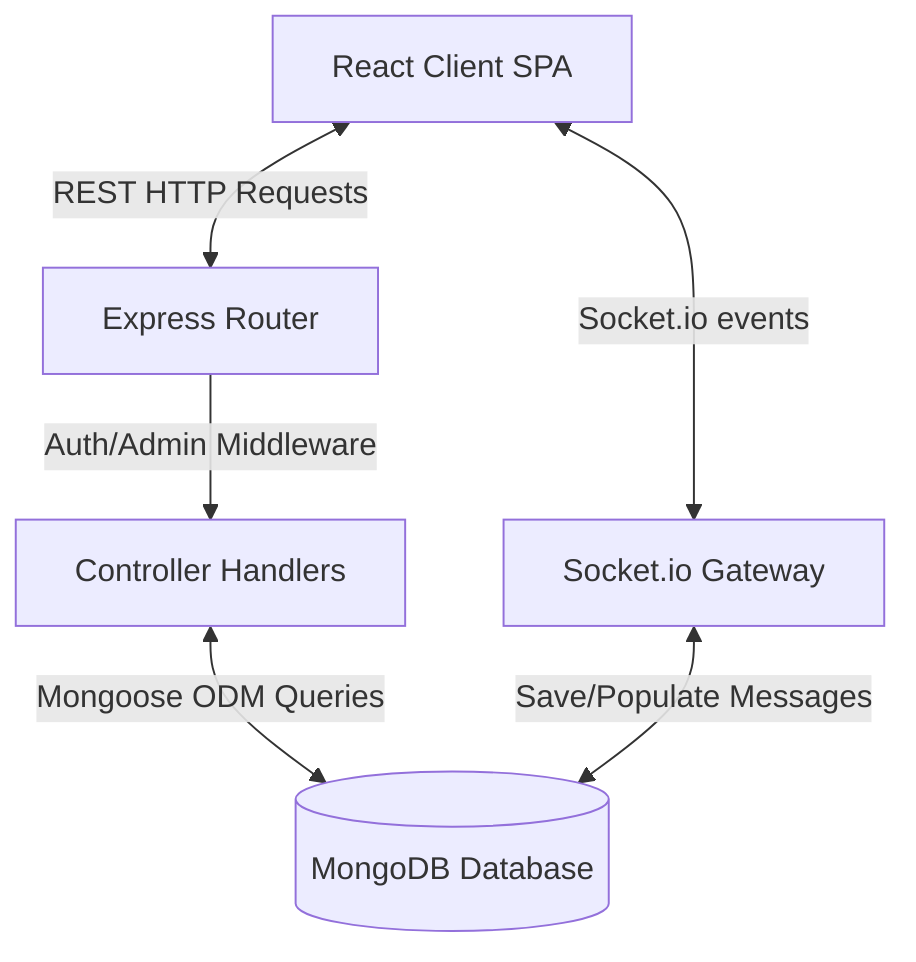
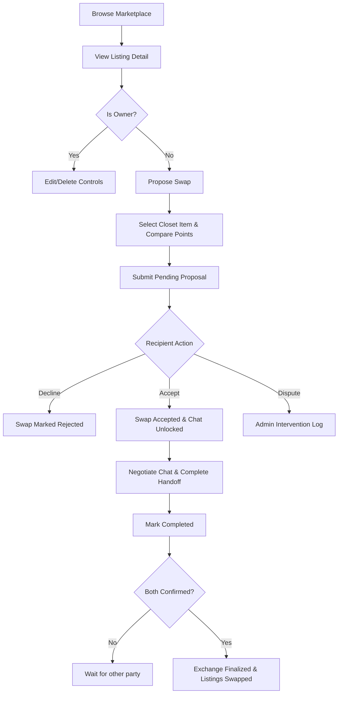
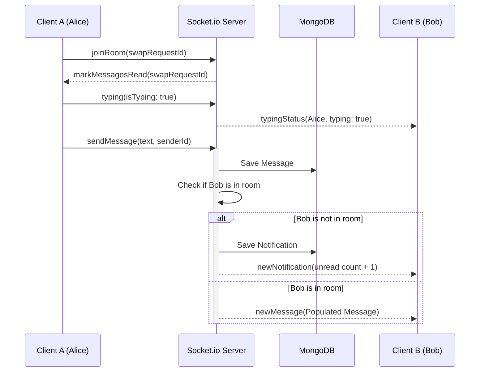
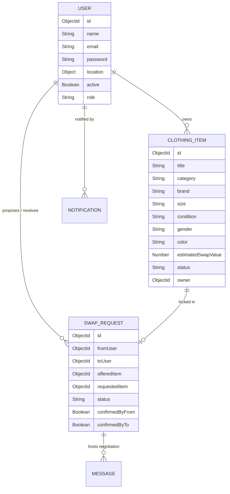

# 🔄 SwapStyle – Clothing Exchange & Swap Marketplace

[](https://swapstyle-clothing-swap-marketplace.vercel.app)
[](https://swapstyle-clothing-swap-marketplace.onrender.com)
[](https://nodejs.org/)
[](https://www.mongodb.com/)
[](https://react.dev/)
[](https://socket.io/)
[](#license)

## 🔗 Live Deployments

- **Frontend Application (Vercel):** [https://swapstyle-clothing-swap-marketplace.vercel.app](https://swapstyle-clothing-swap-marketplace.vercel.app)
- **Backend API Service (Render):** [https://swapstyle-clothing-swap-marketplace.onrender.com](https://swapstyle-clothing-swap-marketplace.onrender.com)
- **GitHub Repository:** [https://github.com/roqaiahanjum/swapstyle-clothing-swap-marketplace](https://github.com/roqaiahanjum/swapstyle-clothing-swap-marketplace)

SwapStyle is a production-ready, full-stack MERN clothing exchange platform. Instead of buying clothes with money, users swap their unwanted garments directly with other members using a virtual point value system. This model promotes sustainable fashion, reduces waste, and establishes an active peer-to-peer exchange community.

The platform integrates custom point value calculators, proximity-based recommendations, private Socket.io negotiations rooms, database and real-time notifications, and full administrative dispute panels.

---

## 🛠️ Tech Stack

### Frontend Client
* **Core Library**: React.js (Vite)
* **Routing**: React Router v6
* **HTTP Client**: Axios (with response error interceptors)
* **Icons**: Lucide React
* **Styling**: Modern CSS3 (Glassmorphism & premium dark mode variables)
* **Real-time**: Socket.io Client

### Backend API Server
* **Environment**: Node.js
* **Framework**: Express.js
* **Authentication**: JSON Web Token (JWT) & bcrypt password encryption
* **Asset Uploads**: Multer (file signature & size validations)
* **Real-time Broadcast**: Socket.io Server

### Database
* **Database Engine**: MongoDB (hosted locally or via MongoDB Atlas)
* **ODM Framework**: Mongoose (referential validation and indexing)

---

## 🚀 Implemented Features

### 🔐 1. Authentication & Security
- Secure registration and login using JWT.
- Password encryption using `bcrypt` (10 salt rounds).
- **Update Password**: Live password update checks verifying existing credentials.
- **Route Guards**: Secure frontend private route wraps and backend auth middleware.
- **Active Status Checks**: Suspended users are locked out of active logins and API requests.

### 👕 2. Closet Listing CRUD
- Create, edit, and delete listings with up to 5 uploaded images (5MB limit).
- Rich clothing attributes: Category, Brand, Size, Condition, Gender, Color, Point Value, Description, and City.
- **Delete Protection**: Deletions are blocked if the listing is locked in active negotiations.

### 🔎 3. Advanced Marketplace Catalog
- Substring regex search matching Title, Description, or Brand.
- Specific filters for Category, Size, Condition, Brand, City, and Point range (Min/Max).
- Custom distance sorting and proximity matching within a km radius limit.
- Offset pagination with bottom page navigation buttons and pulsing skeleton loaders.

### 🔄 4. Double-Confirmation Swap System
- Propose exchanges comparing offered and requested item points side-by-side.
- Match scores evaluate size, condition, and category alignment.
- **Handshake Flow**: Swaps require both users to confirm completion before listings mark as "Swapped".
- **Disputes**: Users can flag items as "Disputed" to request administrator intervention.

### 💬 5. Real-Time Socket Chats & Notifications
- Scoped chat rooms tied to Swap Request IDs.
- Live typing status indicators.
- In-app unread badges that clear on room load.
- Global notification bell broadcasting alerts when users receive offers or trade status updates.

### 🛡️ 6. Admin Panel Console
- **Analytics Charts**: Dynamic CSS percentage distribution tracking listings status.
- **Moderation**: Deactivate accounts or delete listings.
- **Dispute Resolution**: Force Complete or Force Cancel disputed exchanges.

---

## 📈 Database Models

* **User**: Name, Email, Password (hash), Phone, Location (City, coordinates: lat, lng), ProfilePicture, Active, Role.
* **ClothingItem**: Title, Description, Category, Brand, Size, Condition, Gender, Color, Images (array), EstimatedSwapValue, Status, Owner, Location.
* **SwapRequest**: FromUser, ToUser, OfferedItem, RequestedItem, Status, DisputeReason, ConfirmedByFrom, ConfirmedByTo, ResolutionNotes.
* **Message**: SwapRequestId, Sender, Text, Read, Timestamp.
* **Notification**: User, Text, Link, Read, CreatedAt.

---

## 📂 Repository Structure

```
/client
  /src
    /api        (Axios endpoints config & query wrappers)
    /components (Navbar, ListingCard, SwapModal, SkeletonCard)
    /context    (AuthContext, SocketContext, ToastContext)
    /pages      (Landing, Login, Register, Dashboard, Listings, ListingDetail, EditListing, SwapRequests, Chat, Profile, AdminDashboard, NotFound)
/server
  /controllers  (authController, listingsController, swapsController, adminController)
  /middleware   (auth, admin, upload)
  /models       (User, ClothingItem, SwapRequest, Message, Notification)
  /routes       (auth, listings, swaps, admin)
  /sockets      (chatSocket)
  /scripts      (seed database helper)
```

---

## ⚙️ System Architecture Diagrams

### 🌐 System Architecture Diagram


### 🔄 Swap Negotiation Lifecycle Flowchart


### 💬 Sequence Diagram: Message Exchange


### 🗄️ Entity Relationship (ER) Diagram


---

## 🏁 Installation Guide

### Prerequisites
- Node.js (v18+)
- MongoDB running locally on `mongodb://127.0.0.1:27017/swapstyle` or an Atlas URI.

### Step 1: Clone the Repository
```bash
git clone https://github.com/roqaiahanjum/swapstyle-clothing-swap-marketplace.git
cd swapstyle-clothing-swap-marketplace
```

### Step 2: Install Dependencies
```bash
# Server packages
cd server
npm install

# Client packages
cd ../client
npm install
```

### Step 3: Configure Environment Variables
Create a `.env` in the `/server` folder:
```ini
PORT=5000
MONGO_URI=mongodb://127.0.0.1:27017/swapstyle
JWT_SECRET=production_jwt_secret_hash_2026
CLIENT_URL=http://localhost:5173,https://swapstyle-clothing-swap-marketplace.vercel.app
```

Create a `.env` in the `/client` folder:
```ini
VITE_API_URL=https://swapstyle-clothing-swap-marketplace.onrender.com/api
VITE_SOCKET_URL=https://swapstyle-clothing-swap-marketplace.onrender.com
```

### Step 4: Run the Database Seeder
Clear the collection and seed the default accounts and clothing items:
```bash
cd ../server
npm run seed
```

### Step 5: Start Development Servers
In separate terminals:
```bash
# Run Express backend API
cd server
npm run dev

# Run Vite React frontend client
cd client
npm run dev
```

---

## 🖧 REST API Endpoints Overview

| Component | Method | Endpoint | Description | Headers |
|:---|:---:|:---|:---|:---|
| **Auth** | `POST` | `/api/auth/register` | Sign up new user | Multipart/form-data |
| **Auth** | `POST` | `/api/auth/login` | Authenticate user credentials | None |
| **Auth** | `PUT` | `/api/auth/change-password` | Update current password | Authorization: Bearer |
| **Listings** | `GET` | `/api/listings` | Fetch paginated available listings | None (CORS Headers exposed) |
| **Listings** | `POST` | `/api/listings` | Create a closet listing | Authorization: Bearer |
| **Listings** | `DELETE`| `/api/listings/:id` | Remove owned available listing | Authorization: Bearer |
| **Swaps** | `POST` | `/api/swaps` | Propose exchange trade | Authorization: Bearer |
| **Swaps** | `PUT` | `/api/swaps/:id` | Accept / Decline / Complete swap | Authorization: Bearer |
| **Admin** | `GET` | `/api/admin/analytics` | Fetch system metrics & distributions | Authorization: Bearer (Admin) |

---

## 📸 Screenshots

### Home Page


### Marketplace


### Listing Details


### Swap Chat


---

## 🔮 Future Enhancements

- **AI Recommendations**: Recommend listings based on user search behaviors.
- **Image Similarity Search**: Match listings using uploaded photos.
- **Courier Integration**: Integrated shipping label generation.
- **PWA Support**: Offline capabilities and home screen install shortcuts.
- **Dockerization**: Quick container setups for database, client, and server.

---

## 📄 License
This project is licensed under the MIT License - see the [LICENSE](LICENSE) file for details.

## 👥 Authors
* **Roqaiah Anjum E** - *Full Stack MERN Engineering & UI/UX* - [GitHub Profile](https://github.com/roqaiahanjum)
